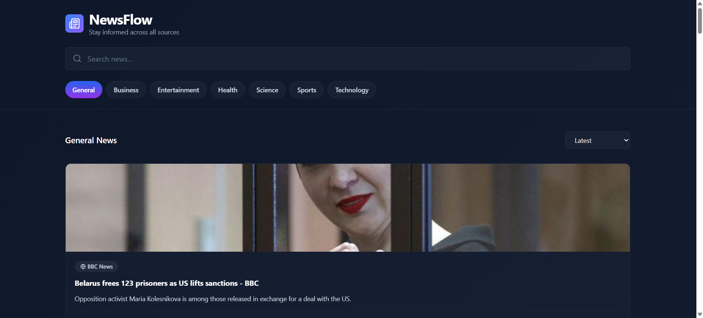

# NewsFlow

A modern, user-friendly news aggregator app that pulls articles from multiple sources using the NewsAPI. Built with React, Vite, and Tailwind CSS.

## Features

- **Search** — Find news on any topic with real-time search functionality
- **Category Filters** — Browse news by category: General, Business, Entertainment, Health, Science, Sports, and Technology
- **Sort Options** — Organize articles by latest, most relevant, or trending
- **Beautiful UI** — Dark theme with a refined editorial aesthetic and smooth animations
- **Responsive Design** — Works seamlessly on desktop, tablet, and mobile
- **Article Details** — View source, publication date, image, and read full articles via direct links

## Screenshots



*The main news feed with category filters, search, and article cards displaying news from multiple sources*

## Getting Started

### Prerequisites

- Node.js (v18 or higher)
- npm or yarn

### Installation

1. Clone the repository:
```bash
git clone https://github.com/yourusername/newsflow.git
cd newsflow
```

2. Install dependencies:
```bash
npm install
```

3. Create a `.env` file in the root directory and add your NewsAPI key:
```
VITE_NEWS_API_KEY=your_api_key_here
```

Get a free API key at [newsapi.org](https://newsapi.org)

4. Start the development server:
```bash
npm run dev
```

5. Open [http://localhost:5173](http://localhost:5173) in your browser

## Usage

- **Search** — Type a topic in the search bar and press Enter
- **Filter by Category** — Click any category button to browse that section
- **Sort Articles** — Use the dropdown to sort by Latest, Most Relevant, or Trending
- **Read Full Article** — Click the "Read" button on any card to open the full article

## Building for Production

Create an optimized production build:

```bash
npm run build
```

Preview the build locally:

```bash
npm run preview
```

## Tech Stack

- **React** — UI library
- **Vite** — Build tool and dev server
- **Tailwind CSS** — Utility-first CSS framework
- **lucide-react** — Icon library
- **NewsAPI** — News data source

## Project Structure

```
newsflow/
├── src/
│   ├── App.jsx           # Main news aggregator component
│   ├── index.css         # Tailwind CSS imports
│   └── main.jsx          # React entry point
├── index.html            # HTML template
├── postcss.config.js     # PostCSS configuration
├── tailwind.config.js    # Tailwind configuration
├── vite.config.js        # Vite configuration
└── package.json          # Project dependencies
```

## Future Enhancements

- Add favorite/bookmark functionality
- Implement infinite scroll for more articles
- Add dark/light mode toggle
- Create article detail page
- Add date range filters
- Support multiple languages
- Cache articles locally
- Add reading time estimates

## API Details

This app uses the [NewsAPI.org](https://newsapi.org) API:
- Free tier: 100 requests per day
- Supports 50+ sources and 40+ countries
- Real-time news data

## License

This project is open source and available under the MIT License.

## Contributing

Contributions are welcome! Feel free to open an issue or submit a pull request.

## Author

Created as a React learning project.